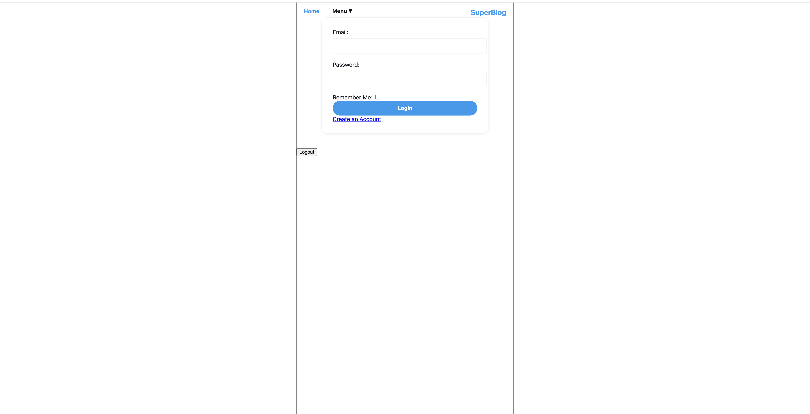
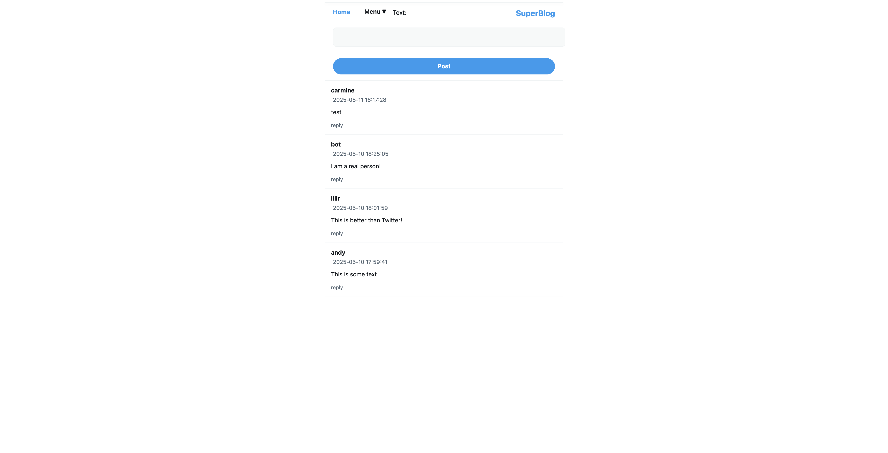
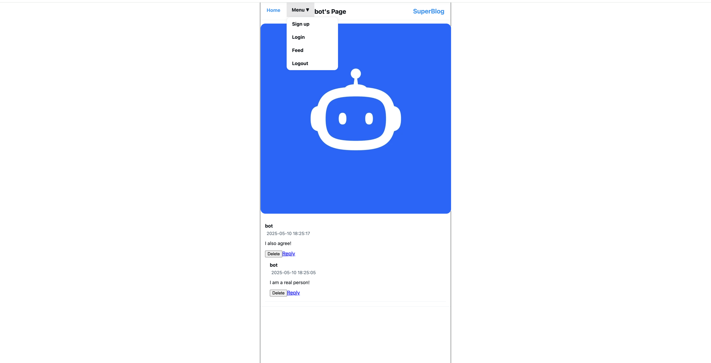
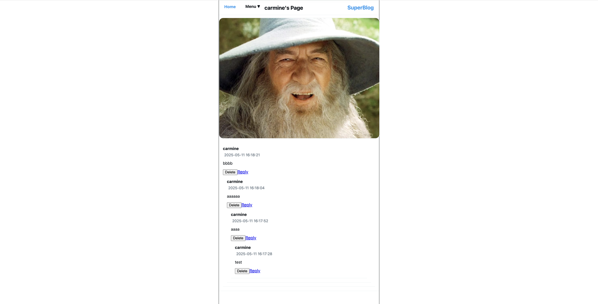
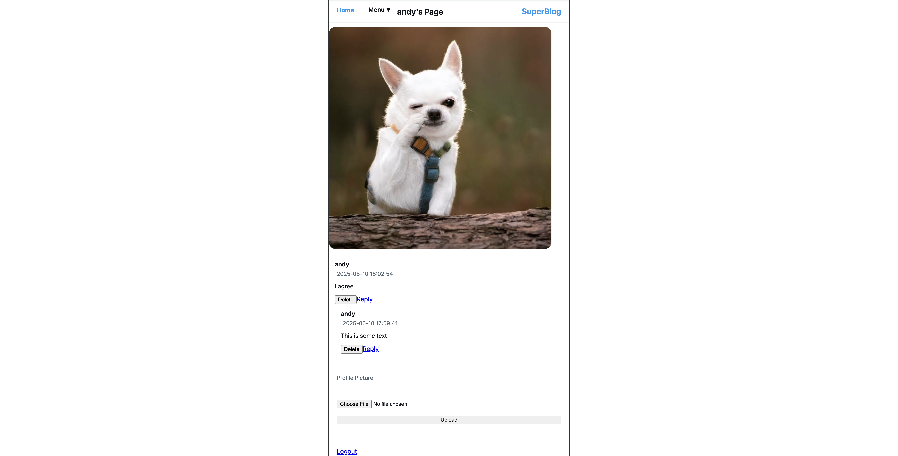

# SuperBlog

A simple blogging website inspired by Twitter, featuring a modern UI and core social features. Built with Python's Flask framework, AWS DynamoDB and S3, and JavaScript for interactivity.

## Features
- User signup and login (with session and remember-me support)
- User profiles with photo upload and personal post feed
- Main feed showing recent posts from all users
- Ability to create posts and reply to posts
- Profile pages with only the user's posts
- Generic profile photo shown if user has not uploaded one
- Secure password storage (recommended for production)

## Technologies Used
- Python 
- Flask
- Flask-Session
- AWS DynamoDB (for data storage)
- AWS S3 (for image uploads)
- JavaScript, HTML, CSS

## Getting Started

1. **Clone the repository:**
   ```zsh
   git clone <your-repo-url>
   cd SuperBlog
   ```
2. **Install dependencies:**
   ```zsh
   pip install -r requirements.txt
   ```
3. **Set up AWS credentials:**
   - Add your AWS access key and secret to the appropriate variables in `server.py`.
   - Ensure your DynamoDB tables and S3 bucket exist as expected.
4. **Run the server:**
   ```zsh
   python server.py
   ```
5. **Open your browser:**
   - Visit `http://127.0.0.1:5000/` to use the app locally.

## Usage
- **Sign up** with a unique email, username, and password.
- **Log in** to access your feed and profile.
- **Create posts** from the feed or your own profile page.
- **Reply** to posts and view threaded discussions.
- **Upload a profile photo** from your profile page.
- **Click usernames** to view their profile and posts.

## Screenshots

### Login


### View After Login


### Profile Pages





